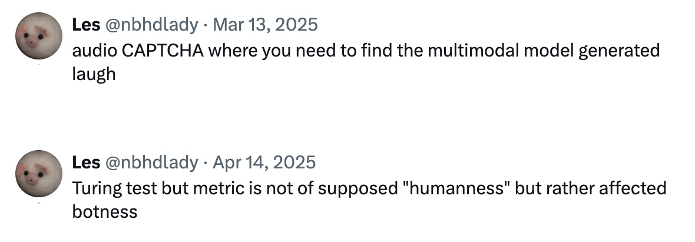

# Artifact 2.2: laughCAPTCHA

A speculative CAPTCHA that determines user legitimacy via their performed laughter.

## Background

In my quest to make sense of CAPTCHAs as a technology that reflects one’s relationship with and attitude towards data collection, “human” as a label, and more, I wanted to make something that is intensely performative that is physically taxing and emotionally ambiguous.

The user must submit a laugh that is at least 50% similar to a provided “target” laugh. They may choose to configure a baseline laugh beforehand to tailor the provided laugh to their approximate vocal range. They are invited to share every/any laugh they record, though this is voluntary.

## Bibliography

### System

Each round of laughCAPTCHA compares the user's submitted laugh with the target as follows:

1. Both recordings are analyzed in overlapping 46 ms windows (frames), stepping forward ~12 ms at a time so that each moment in the audio is captured multiple times from slightly different positions — producing a dense, continuous feature sequence. Each frame yields two values: a 13-value MFCC vector and a single F0 value.

We use the **MFCC (Mel-frequency cepstrum coefficient) vector** to characterize the sound’s spectral shape as perceived by the human ear — its timbral profile. It is derived by transforming the frame through an FFT, mapping the result onto a perceptual frequency scale (the mel filterbank), taking the log of the energies, and compressing the result via a DCT into 13 coefficients.

We use **F0 (fundamental frequency)** to characterize perceived pitch via autocorrelation: the frame is compared against a time-shifted copy of itself — a periodic signal (such as a voiced "ha") produces a strong peak at the shift corresponding to its pitch period, from which F0 is derived. Frames with no detectable periodicity are marked unvoiced and return F0 = 0; laughter is largely unvoiced, so this is common.

2. The two recordings’ MFCC sequences are compared using Dynamic Time Warping (DTW), which finds the optimal non-linear alignment between them. This corrects for natural variation in pacing — a laugh delivered slightly faster or slower than the target is not automatically penalized — though it loses precise durational information in exchange. The resulting distance is converted to a 0–100 mScore.

The median F0 of both recordings is also compared as a ratio: a perfect pitch match scores 100, a complete mismatch scores 0. If either recording has too few voiced frames to estimate pitch reliably — common in laughter — this defaults to a neutral mid-range value. This produces a pScore.

3. The final round score is 75% mScore + 25% pScore. A score of 50 or above is required to advance in the first seven rounds.

### Libraries, Resources, Tools
* [Meyda.js](https://wac.ircam.fr/pdf/wac15_submission_17.pdf) for audio feature extraction
* WebAudio API to access audio buffer
* WaveSurfer.js to visualize waveforms.
* ElevenLabs for target laugh generation.

## Iterations, Obstacles, Lessons

A note on “retconning” learnings.

## Acknowledgements

Scott Johnson for “John Somebody;” Claude Code, Perplexity, and Google Gemini for sketching this out; Rich Nisa for directing me to Pete Holmes’ end-of-podcast-episode laughs; Rich Pell for directing me to the OKeh Records.

## Continued Work

1. Picking apart the scoring algorithm
2. Adding final souvenir once past all rounds of CAPTCHA: currently thinking a collection of different related media.
3. Gallery of user submitted laughs available as soundboard — make this the souvenir?