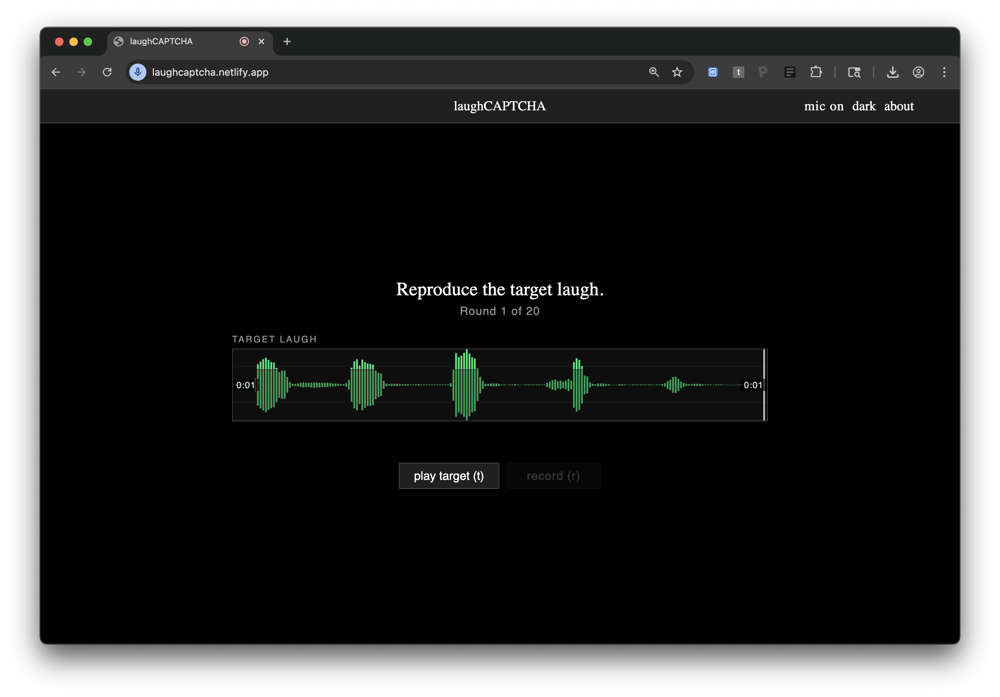
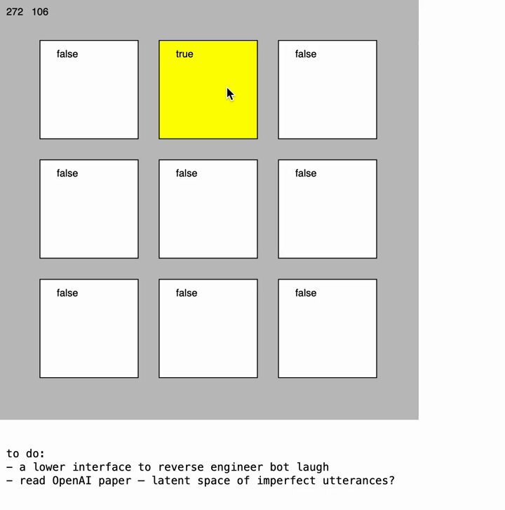
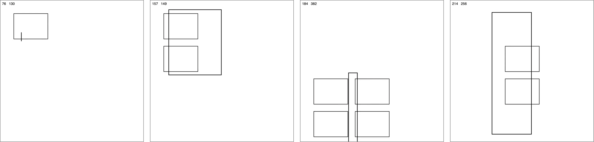
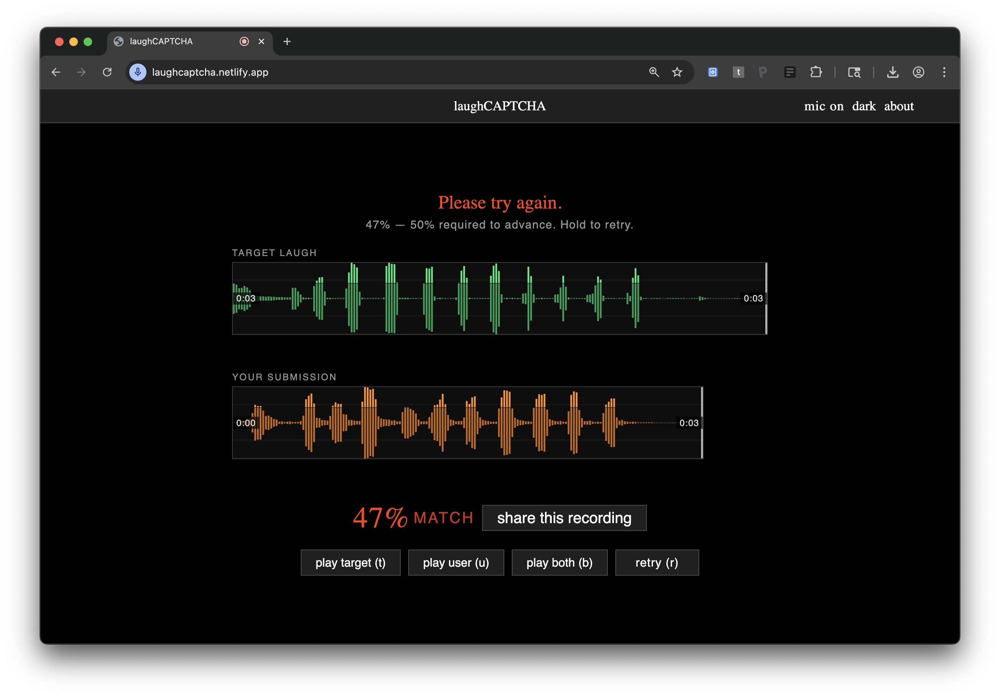
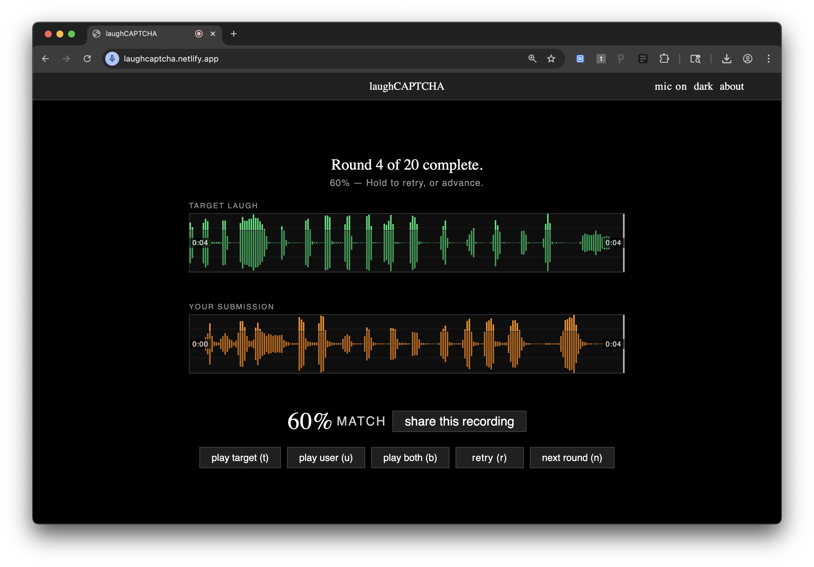

# laughCAPTCHA
`A chapter from my thesis document.`

## System
laughCAPTCHA is my first CAPTCHA to seriously engage with a scoring mechanism. It presents users with a synthesized “target laugh” to mimic.[^1] Continuing along the high-volume nature of envCAPTCHA, laughCAPTCHA is a test of physical and emotional endurance—the entire CAPTCHA spans twenty rounds of laughing, with each round’s target laugh lengthening by a second.

_Figure 1. A round of laughCAPTCHA._

Staying with the inexpressible ambivalence of envCAPTCHA prompts, laughCAPTCHA focuses on the opacity of CAPTCHAs’ scoring mechanisms, which offer users no explanation into how or why they have failed.[^2] The laughCAPTCHA scoring algorithm constructs the human-bot binary that reCAPTCHA and hCaptcha lean on for their user experience. In its insistence on at least 50% similarity with the synthetic target, this CAPTCHA aims to make the laugh—a personal and often involuntary expression of joy, vulnerability, or human resonance—a site for data extraction. By encroaching ever closer on the human psyche and our human “cycles,” it asks, what data might the groveling subject be willing to cede? What is the final frontier of datafication, if it exists? If there is a last CAPTCHA that bookends our current chapter of human computation, what might it be?

When presented with the prospect of designing a laugh CAPTCHA, our initial instinct might be to identify a human laugh from a chorus of synthesized bot laughs. However this presents tricky implications of normativity and neurotypical expression. As I mulled over this idea in the spring of 2025, I opted to make an AIML-synthesized laugh the standard instead (Figure 2). This partly mirrors the use of synthesized media for CAPTCHA challenges as anecdotally observed with CAPTCHA Diary, and also makes use of “voice mode” features of productized large language models that have enchanted much of mainstream American tech press since 2022–23.[^3] If a machine learning model’s internal representation of a default, “natural,” or “standard” laugh were the norm, then what space exists along the boundary of human and bot that we can wander across?

_Figure 2. Top: crude sketch of laughCAPTCHA using GPT4o audio model output, April 30, 2025. Bottom: an iteration of the sketch above on May 10, 2025. Both scrapped for their use of the square grid, which is a weird holdover from image-based CAPTCHAs.[^4]_

In order to synthesize target laughs with more control, I used ElevenLabs’ Sound Effects generation interface, which has a toggle for synthesizing looping audio.[^5] Though there were considerations and ambitions to enable on-demand, infinite target laugh synthesis by connecting to the ElevenLabs API, I wanted to keep my laughter synthesis footprint low to ensure proper target laugh curation. Thus I synthesized three batches of twenty laughs, each ranging from one to twenty seconds, to accommodate a rough estimate of low, mid, and high-range pitch (Table 3). Each batch was then assembled by using one of three prompts, varying duration using an ElevenLabs-provided slider.

|duration \ pitch | Low | Mid | High |
| ----- | ----- | ----- | ----- | 
| 1–6s | A man laughing. Deep, natural, genuine. | A person laughing. Natural, genuine, mid-range voice. | A woman laughing. Bright, natural, genuine. |
| 7–13s | A man laughing. Deep, sustained, escalating, continuous. | A person laughing. Sustained, escalating, continuous, mid-range voice. | A woman laughing. Bright, sustained, escalating, continuous. |
| 14–20s | A man laughing continuously. No breath breaks, no inhalation, no pauses. Unbroken. | A person laughing continuously. No breath breaks, no inhalation, no pauses. Unbroken. Mid-range voice. | A woman laughing continuously. No breath breaks, no inhalation, no pauses. Unbroken. |

_Table 3. Prompts used for ElevenLabs sound effect synthesis. Prompt influence was set to 0.75._

The prompts themselves were written with language that skewed gender-binaristically to inherent as many biases as the ElevenLabs audio model’s training data had already baked in.[^6] Curation of the final sixty clips involved selecting for audio that revealed the materiality of synthesized sound—whether it be indeterminate moments where one perceived speaker’s breathing morphs into another’s, or tracks whose choreography of breathing appears physically implausible. Using synthesized media in such a way makes normativity a recursive imitation: the CAPTCHA evaluates users’ mimicry of a model’s median performance of human sociality. This makes laughCAPTCHA partially a reflection on the use of “liveliness” and “naturalness” as fuzzy terms for generative (synthesized) audio model benchmarking. Because the underlying training data is not inspectable, one can only assume some partiality in what corners of the web are represented. As with other machine learning models used to synthesize new media—and as the debate on “vibe coding” persists—the imprint of the internet that is most accurately reflected in the model can never represent “reality” in its totality. No two users’ narration and experience of the internet are going to match because this is always colored by personal experience.[^7] The “vibe” and norm in question, then, are artifacts of media synthesis model development processes.[^8] 

_Figure 4. A failed round of laughCAPTCHA. Buttons below the user submission allow for
playback, though the measures in which a user failed remain undisclosed._

The use of laughter as a signal also emerged from my absorption of media about auditory illusions (specifically the talking piano) and encountering composer Scott Johnson’s album _John Somebody_ along with his associated project, _Involuntary Song_.[^9] These tracks’ use of human vocals as a material to sample, cut, and loop over was striking to me. There was something lovely in the stumbling over of “I was thinking about” and “remember that guy?” that I wanted to pull on. Filler words and pauses in speech that, now, might be mercilessly cut out by transcription software, here, open up as entire worlds. 

Additional sources of inspiration for this CAPTCHA range from show business audio engineering—the development of the laff box, canned laughter, and “laugh sweetening” in sitcoms—as well as a particular TikTok video from 2023 that compiles moments of some men standing outside a pub chatting, beers in hand.[^10] The editor’s cuts compose an impression of a fun night out, complicated by the people in the video acknowledging the camera’s presence, which make performativity and authenticity contentious. The video’s immediate infamy hints at potential self-surveillant smoothing of gestures, gaits, ways of holding and composing oneself that are aspirational, attractive, or desirable.[^11] 

_Figure 5. A successful round of laughCAPTCHA._

On the matter of scoring, each round of laughCAPTCHA compares the user's submitted laugh with the target as follows:[^12]

First, both recordings are analyzed in overlapping 46 millisecond windows (frames), stepping forward ≈12 ms at a time so that each moment in the audio is captured multiple times from slightly different positions. This produces a dense, continuous sequence of audio features for extraction and analysis. Each frame yields two values: a 13-value Mel-frequency cepstrum coefficient (MFCC) vector and a single F0 value. 

We use the MFCC vector to characterize the sound’s spectral shape as perceived by the human ear. It is derived by transforming the frame through the fast fourier transform algorithm, mapping the result onto a perceptual frequency scale (the mel filterbank), taking the log of the energies, and compressing the result via a discrete cosine transform into 13 coefficients.

We use F0 (fundamental frequency) to characterize perceived pitch via autocorrelation, where the frame is compared against a time-shifted copy of itself. A periodic signal (such as a voiced “ha”) produces a strong peak at the shift corresponding to its pitch period, from which F0 is derived. Frames with no detectable periodicity are marked unvoiced and return F0 = 0.

Second, the two recordings’ MFCC sequences are compared using dynamic time warping (DTW), which finds the optimal non-linear alignment between them. DTW corrects for natural variation in pacing—a laugh delivered slightly faster or slower than the target is not automatically penalized—however it loses precise durational information in exchange.[^13] The resulting distance is converted to a 0–100 mScore.

The median F0 of both recordings is also compared as a ratio: a perfect pitch match scores 100 and a complete mismatch scores 0. If either recording has too few voiced frames to estimate pitch reliably, the median F0 defaults to a neutral mid-range value. This produces a pScore.

Third, The final round score is 75% mScore + 25% pScore. A score of 50 or above is required to advance.

So-called “personalization” of one’s laughCAPTCHA experience is available for users to share a sample of their vocal range to better match laughter batches to their pitch. Every round of laughCAPTCHA includes a “share this recording” button for users to volunteer their laughter if they wish.

## Reflection

laughCAPTCHA is physically and psychically draining. My best performance during a month of testing was advancing to the ninth rounds of the scheme when matched to high-pitched laughs. While I had assumed that mid-range pitched laughs would be better tailored to my own vocal range, they proved to be unamusingly difficult. This suggests that though target laugh curation aspired to be as detached and “objective” as possible, the synthesized laughs themselves are not comparable across each round of the laughCAPTCHA. The game is already rigged from the start.

My insider knowledge of the development process of laughCAPTCHA disenchanted the scheme for me. Though the novelty soon wore off, a productive finding in testing laughCAPTCHA myself was recognizing a new emotion in my groveling: intense loathing. Perhaps because of the forced evocation of joy that laughCAPTCHA requires, a new flavor of _disdain_ has emerged in my interactions with this CAPTCHA. The coercive frame makes laughing an act that requires composure. Completing laughCAPTCHA in public is a courageous thing to do, because it upsets typical social expectations; while it may not put the human computer’s own “personal,” “natural” laugh on trial, it certainly does spotlight their strained performance of the target laugh’s imagined sociality.

Christian Moeller’s 2003 artwork Cheese is instructive here.[^14] Moeller filmed several actors, assessed live by an emotion recognition program, holding a smile for as long as possible in “an experiment in the architecture of sincerity.”[^15] Persistent forced smiling (Moeller characterizes this a “performance of sincerity”) after an hour and a half slips into the uncanny: the smile calcifies, elicits jaw pain, and the audience might begin to identify some other complex affect in the actor’s gaze.[^16] In laughCAPTCHA the forcible evocation of laughter makes human expression (rather than cognition per von Ahn’s script of CAPTCHA) once again measurable and calculable for machinic ends. The groveling in laughCAPTCHA is groveling before a scoring algorithm whose very setup is absurd, haphazard, and inherently subjective. The disdain I feel (towards myself? Towards the laughCAPTCHA?) is a much more intensified version of how I feel when I happen across hCaptcha’s cartoon imagery, whose sheer cuteness feels condescending. At some point during my own testing of laughCAPTCHA I wondered if it bears more resemblance with contemporary CAPTCHA schemes that use failure as a metric of personhood.

CAPTCHA Club reception of laughCAPTCHA has varied. Some folks were plainly interested in the scoring algorithm; others devised tactics to reliably pass the CAPTCHA, clapping to rehearse salient parts of the target laugh. A friend called it demonic: because an acquired laugh is not necessarily readable as something that is scorable or measurable, the laughCAPTCHA has the effect of making people feel as if their own laughs are being scored for humanness. Reflecting on the dataset that this CAPTCHA would enable—a collection of affected, fake human laughter aspiring towards synthetic botness—brings to mind less about CAPTCHAs and more meditations instead on the valorization of synthesized media’s apparent polish.[^17] 

[^1]: IFDE, “laughCAPTCHA,” 2026, https://laughcaptcha.netlify.app/.
[^2]: This might be the point: that rhetorically innate human abilities to perceive things are considered universally applicable and fixed.
[^3]: In the autumn season of 2022 I began regularly following The New York Times’ Hard Fork podcast hosted by Kevin Roose and Casey Newton. I began to fade out my absorption of this media in fall 2023.
[^4]: IFDE, “‘Audio CAPTCHA Where You Need to Find the Multimodal Model Generated Laugh,’” X (formerly Twitter), March 13, 2025, https://x.com/nbhdlady/status/1900285804431253795.
[^5]: Manually prompting OpenAI’s GPT models in voice mode had become ineffective by fall of 2025. I tried Nari Labs’ open sourced Dia audio model, whose interface curiously includes a soundboard of emoji corresponding to different “sound effects,” each a button: “😏chuckle,” “😌inhales,” “😮‍💨exhales,” “😲gasps,” “😷coughs,” “🤧sneezes,” “👃sniffs,” and “😫groans,” for example.
[^6]: I have not been able to find a whitepaper or official text from ElevenLabs that discloses the source of its audio models’ training data. While automatic speech recognition models in the academic literature often cite the use of the LibriSpeech corpus for training and benchmarking audio models, a definitive link is not provable. LibriSpeech itself is taken from LibriVox, a collection of audiobooks in the public domain that have been read aloud by volunteers. “LibriSpeech ASR Corpus,” OpenSLR (Open Speech and Language Resources), accessed May 4, 2026, https://www.openslr.org/12; Alexei Baevski et al., “Wav2vec 2.0: A Framework for Self-Supervised Learning of Speech Representations,” ed. H. Larochelle et al., arXiv [cs.CL] (June 19, 2020), arXiv, https://doi.org/10.48550/arXiv.2006.11477; “LibriVox and Artificial Intelligence (AI),” accessed May 4, 2026, https://wiki.librivox.org/index.php?title=LibriVox_and_Artificial_Intelligence_(AI).
[^7]: To cite the most canonical origins of this term, “vibe coding,” I point again to this X formerly Twitter user’s post from 2025: Karpathy.
[^8]: I use “generative (synthesized) audio model,” “media synthesis model,” and the like to refer to what the industry and academia call “generative AI model.” This is a rhetorical distinction that I have tried to practice throughout this thesis, following Emily M. Bender’s term, “synthetic text-extruding machines,” to remind myself of the fact that these models pull from extant media and the “newness” that I might perceive emerges more from my interactions with syntactic reorganization than the models’ source material being new, unique human experiences of the world. Emily M. Bender, “Synthetic Text Extruding Machines: A Linguist-Eye View on Their Narrow Range of Applicability,” https://faculty.washington.edu/ebender/papers/Linguist-eye-view.pdf; Michael J. Reddy, “The Conduit Metaphor: A Case of Frame Conflict in Our Language about Language,” in Metaphor and Thought, ed. Andreweditor Ortony (Cambridge University Press, 1993), 164–201. 
[^9]: Scott Johnson, “John Somebody (1980-82) 28.00,” accessed June 9, 2025, https://scottjohnsoncomposer.com/compositions/johnsomebody.html; Javiera Cisterna Cortés, “Scott Johnson - John Somebody” (Youtube, November 6, 2017), https://www.youtube.com/watch?v=qsLyP6ObTbQ.
[^10]: Chris Saunders, “Why Is Everyone Obsessed with ‘Pints, Chit Chat and Good People’?,” HUNGER, November 7, 2023, https://hungermag.com/editorial/why-is-everyone-obsessed-with-pints-chit-chat-and-good-people.
[^11]: This draws out a longer tangential thread about what it means to do (comedic) impressions of someone; the role of the recording device (camera) in performativity; and more that are not relevant to this thesis.
[^12]: As I used Claude Code to implement this system, much of the development process involved dipping into audio processing fora and online videos for a technical understanding. Valerio Velardo, “Mel-Frequency Cepstral Coefficients Explained Easily” (Youtube, October 5, 2020), https://www.youtube.com/watch?v=4_SH2nfbQZ8; James Lyons, “Practical Cryptography,” accessed May 1, 2026, http://practicalcryptography.com/miscellaneous/machine-learning/guide-mel-frequency-cepstral-coefficients-mfccs/.
[^13]: This means that given a sequence of laughs, while the order in which different sounds occurred is accounted for, the precise length of each part of the laugh is not weighted as highly.
[^14]: Christian Moeller, Cheese, 2003, 2003, https://christianmoeller.com/Cheese.
[^15]: Moeller.
[^16]: Moeller.
[^17]: I define “botness” as the quality or state of being identified as a bot, machine, program. Additional feedback has proposed a CAPTCHA that collects the sounds of breaths taken during/before different social situations, which I feel does not yet incorporate enough groveling to pursue as a tangential test CAPTCHA. Also see Tina Tarighian, “Take a Deep Breath,” accessed May 4, 2026, https://100-deep-breaths.com/.
