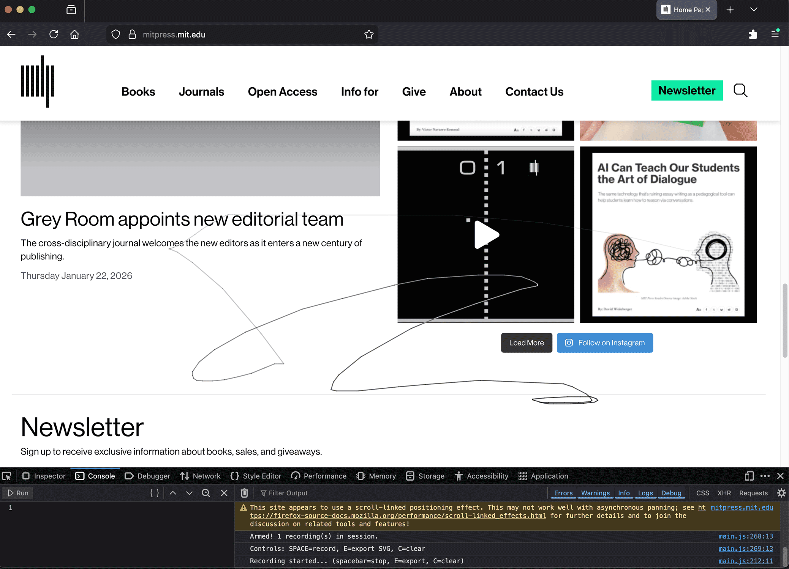
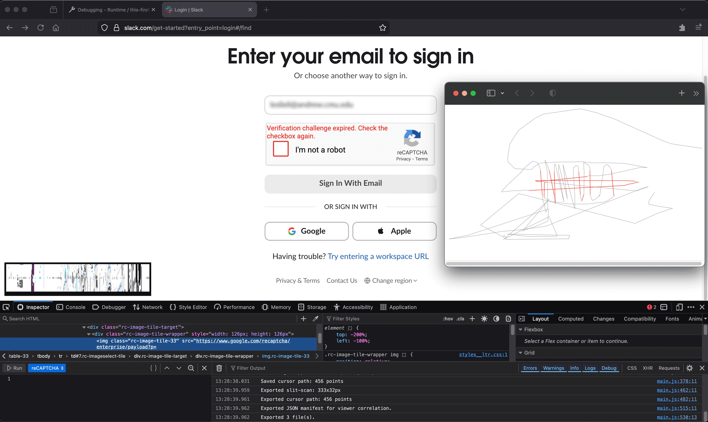

# Your Biggest Fan

A Firefox extension for a user to track their cursor movement and annotate segments comprising CAPTCHA work.

`To add:` it’s not about “humanness” score, more about data collection. How this supports the Log.

### Background
The name for this extension comes from a stray idea from Fall 2024 for a theory class assignment to make something that responds to the collection and accumulation of everyday (perhaps domestic) data. Reflecting on various universities’ use of student ID swipes to surveil student activity, I sketched out a robotic arm-based drawing of my location across campus. 

“Your Biggest Fan” has returned as a cursor tracker that’s a side quest as I develop a CAPTCHA Log to help me better reflect on my daily encounters with CAPTCHAs. The extension is Firefox based for now to respect my personal browsing habits. The goal: reasonably nebby awareness.

### Bibliography
Shan Huang, _[Iconic History](https://github.com/yemount/IconicHistory)_ (2014); Kyle McDonald, _[Important Things](https://www.flickr.com/photos/kylemcdonald/5430950331/in/album-72157625874470177)_ (2011); Robert M Ochshorn & Eyal Sivan, _[Montage Interdit](https://rmozone.com/montageinterdit/)_ (2012). 

I’ve long been a fan of Ochshorn’s work on compression and video transcription interfaces. I learned of slit scans through the video archive he and Sivan built — being able to sift through the media from different entry points, whether the video itself, its transcription, speakers, or tags — has been an incredibly resonant interaction paradigm. [Daragh](https://daraghbyrne.me/) shared Huang’s _Iconic History_ and [Golan](https://github.com/golanlevin/60-412) directed me to McDonald’s _Important Things_ — both works that visualize personal interfacing with the web in a tapestry-like grid format. 

### Iterations, Obstacles, Lessons
Starting out with tracing the cursor’s movement, the extension exports an SVG of past cursor positions:

This loses the feeling of _local_ context as afforded by McDonald’s _Important Things_ — consulting Ochshorn & Sivan, I included a small slit scan preview window in the lower left that populates as the cursor moves around.

Testing this on a known domain that serves CAPTCHAs revealed a central limitation: due to cross-origin resource sharing standards, I wouldn’t be able to grab page data of CAPTCHAs that load as popups. My current workaround is to combine the SVG cursor path and the slit scan to add as much lost context as possible.

### Acknowledgements
Thank you to Golan and Daragh for your generous &lt;a&gt; energy; Huang, McDonald, Ochshorn & Sivan for your work; Claude Code (CC), W3Schools, Mozilla and Chrome’s developer docs writers for technical and conceptual support and debugging.

My CC use in this project is heavier than my usual preferences (setting up the text extrusion model to serve as a programming coach and approxiamte guide whilst writing most of the code manually myself). This experiment saw me using extant web resources to get a high-level picture, then using CC to make something/anything, and reviewing the code with both entities nearby to understand how the program has changed and what blockages remain.

### Continued work
The natural extension of this is to address CORS and devise another way to detect CAPTCHA placement (provided that the scheme is not made invisibile or hidden), as [the Log](../README.md) aims to accomplish. A nearer short-term goal is to make a lightweight linked and brushable interface to trace the slit scan across the SVG.