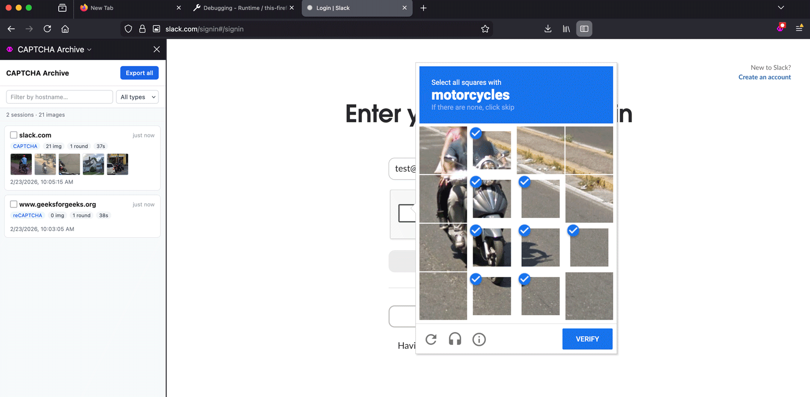

# Diary

Working code for a Firefox extension to record diary entries of CAPTCHA encounters.

### Background

I want to make my everyday encounters with CAPTCHA concrete and useful as personal data. I adapted the [Log](../README.md), which downloads encountered CAPTCHA media to the user’s local folder, into a diary that lives in the browser as an extension.

<!-- ### Bibliography

CITE A PAPER. -->

### Process

Adapting the Log into a Diary so far has highlighted the constraints of rapid managerial LLM-based coding. 

<!-- While my adventures so far into scraping have  -->

### Acknowledgements

Programmed with Claude Code (CC). System architecture and code inspection via Google Gemini, Perplexity, and GPT 5.2. Thanks to Daragh and Golan for nudging me back on track.